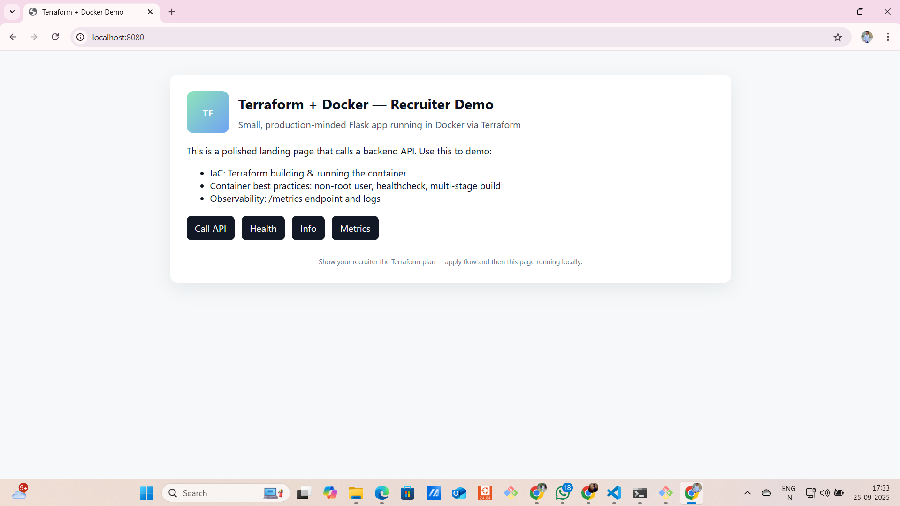

# Recruiter-Ready Project: Terraform + Docker + Flask Web App

## Overview

This project demonstrates **Infrastructure as Code (IaC)** by provisioning a **Flask web application** inside a **Docker container** using **Terraform**.  
It is designed to impress recruiters with clean code, best practices, and a fully functional landing page.

**Key Features:**
- Deploys a Flask app with **responsive frontend** and multiple backend API endpoints.
- Runs inside **Docker** and is managed via **Terraform**.
- Multi-stage Dockerfile for optimized image size.
- Non-root user and healthcheck for container best practices.
- `/health`, `/info`, `/metrics`, `/api/hello` endpoints for demo and observability.
- CI template using **GitHub Actions** for Terraform validation and Docker build tests.
---

## 📂 Project Structure

```bash
terraform-docker-flask/
│
├─ app/
│  ├─ Dockerfile
│  ├─ requirements.txt
│  ├─ app.py
│  ├─ templates/
│  │   └─ index.html
│  └─ static/
│      └─ placeholder.txt
│
├─ main.tf                  # Terraform code to build image & container
├─ variables.tf             # Terraform variables
├─ outputs.tf               # Terraform outputs
├─ terraform.tfvars.example # Example variables
├─ Makefile                 # Quick commands for terraform
├─ README.md                # This file
└─ .github/workflows/       # GitHub Actions templates
   ├─ terraform-check.yml
   └─ ci-docker-build.yml


## Prerequisites

- **Terraform ≥ 1.3.0**
- **Docker** (Docker Desktop for Windows / Docker Engine for Linux/WSL)
- Optional: **WSL** if using Windows for smooth Linux container compatibility

---

## Getting Started

### 1. Clone the repository

```bash
git clone https://github.com/<your-username>/terraform-docker-flask.git
cd terraform-docker-flask
2. Set Docker Host (Windows only)
export TF_VAR_docker_host="npipe:////./pipe/docker_engine"


Linux/WSL users can use the default unix:///var/run/docker.sock.

3. Initialize Terraform
terraform init

4. Plan the Infrastructure
terraform plan -out=tfplan

5. Apply the Infrastructure
terraform apply tfplan

6. Open the App

Open in your browser:

http://localhost:8080


You should see the landing page, and the following endpoints are available:

/ → Landing page

/api/hello → API returning a welcome message

/health → Health status

/info → Container and host info

/metrics → Custom metrics

7. Destroy the Infrastructure

After demo:

terraform destroy -auto-approve

How It Works

Terraform builds the Docker image from app/Dockerfile.

Terraform creates a container from the built image.

Container exposes port 5000 internally and maps to host port 8080.

Healthcheck ensures the app is running.

Outputs provide the container ID and app URL.

Recruiter Highlights

Demonstrates IaC using Terraform.

Shows Docker best practices:

Multi-stage Dockerfile for optimized size

Non-root user

Healthcheck

Shows Flask app with frontend + backend endpoints.

Includes CI/CD workflow templates (GitHub Actions).

Easy to run locally → perfect for live demo.

Clean folder structure, Makefile, and README.md for professional submission.

## Screenshots
 

Author

Maddali Karna
DevSecOps Engineer | Cloud & IaC Enthusiast
Email: maddalikarna9@gmail.com

GitHub: https://github.com/Karna-Maddali

